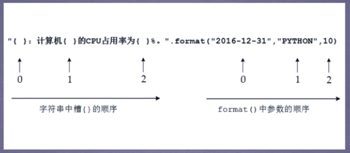

# 中国大学排名实例

输入：大学排名url链接

输出：大学排名信息的屏幕输出

技术路线： requests + bs4

定向爬虫：仅对输入url进行爬取，不扩展爬取

程序结构设计
	1. 从网络上获取相关内容 **getHTMLText()**
	2. 提取内容信息到合适的数据结构（二维列表） **fillUnivList()**
	3. 利用数据结构展示并输出结果 **printUnivList()**

