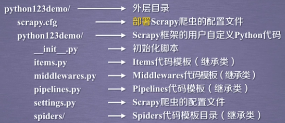
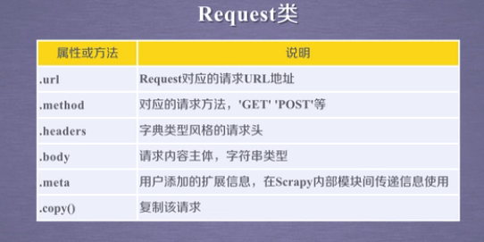
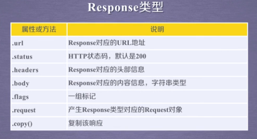

# 第一个实例

demo网站 https://python123.io/ws/demo.html

文件名：demo.html

- 产生步骤

1. 建立一个爬虫工程 scrapy startproject python123demo

2. 在工程中产生一个爬虫 scrapy genspider demo python123.io

	parse()用于处理响应，解析内容形成字典，发现新的url爬取请求

3. 配置产生的爬虫 修改demo.py文件

4. 运行爬虫，获取网页 scrapy crawl demo

如果运行报错no module named "win32api" 则需要安装pywin32模块

使用命令pip installl pypiwin32即可

- 生成的工程目录



# yield关键字的使用

yield是一个不断产生值的函数

包含yield语句的函数是一个生成器

生成器每产生一个值（yield），函数就会被冻结，被唤醒后再次产生一个值

- 实例

```
>>>def gen(n):
	for i in range(n):
		yield i**2
```

生成器一般和for循环一起使用

- 为何要用生成器

相比于一次列出所有内容

生成器更节省存储空间，响应更迅速，使用更灵活

# scrapy爬虫的基本使用

1. 创建一个工程和spider模板

2. 编写spider

3. 编写item pipeline

4. 优化配置策略

- 数据类型

1. request类 	向网络上提交请求的内容

	- class scrapy.http.Request()
	- Request对象表示一个http请求
	- 由spider生成，由downloader执行



2. response类 	从网络中爬取内容的封装类
	
	- class scrapy.http.Response()
	- response对象表示一个http响应
	- 由downloader生成，由spider处理



3. item类 	由spider产生的信息

	- class scrapy.item.Item()
	- item对象表示从一个html页面中提取的信息内容
	- 由spider生成，由item pipeline处理
	- item类似字典类型，可以按照字典类型进行操作

-  CSS selector 使用

<HTML\>.css('a::attr(href)').extract()


