# 信息标记的3种形式

'name' 刘星

'age'  18

HTML的信息标记

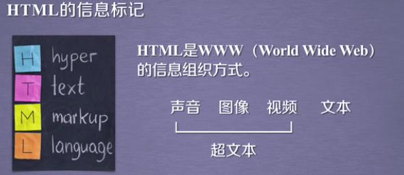

HTML通过预定义的<>...</>标签形式组织不同类型的信息

**XML，JSON，YAML** 3种主流标记形式

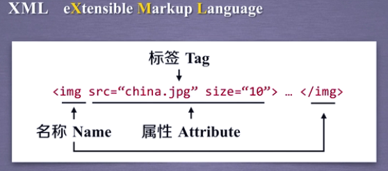

XML是HTML基础上发展起来的一种信息标记形式

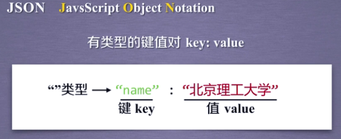
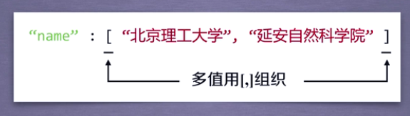
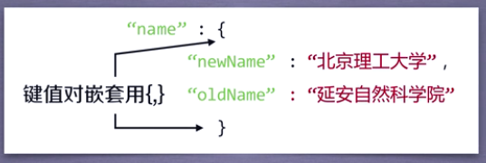

JSON是用有类型的键值对表达信息

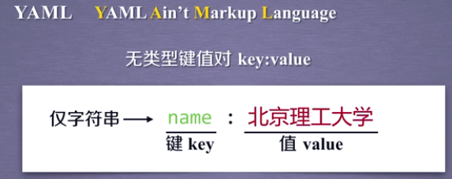
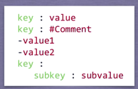

YAML是用无类型的键值对表达信息

## 三者的比较

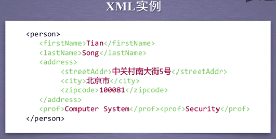
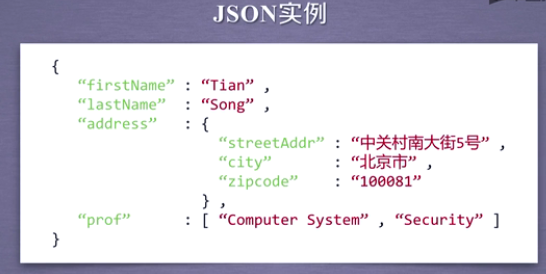
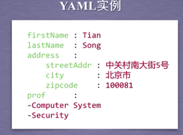

XML Internet上的信息交互

JSON 移动应用云端和节点的信息通信，无注释

YAML 各类系统的配置文件，有注释

# 信息提取的一般方法

1. 完整解析信息的标记形式，再提取关键信息
- 优点：信息解析准确
- 缺点：提取过程繁琐，速度慢

2. 直接搜索关键信息
- 优点：提取过程简洁，速度快
- 缺点：提取结果准确性与信息内容相关

3. 融合方法
需要**信息标记解析器**和**文本查找函数**

操作实例
```
import requests
from bs4 import BeautifulSoup

url = "https://python123.io/ws/demo.html"
demo = requests.get(url)
soup = BeautifulSoup(demo.text,'html.parser')
for link in soup.find_all('a'):
	print(link.get('href'))
```

# 内容查找方法
**find_all**

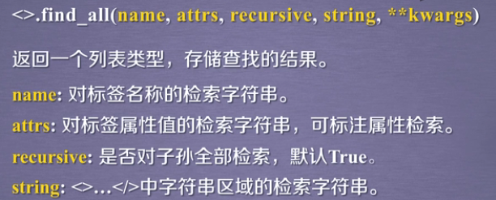

soup(..) 等价于 soup.find_all(..)

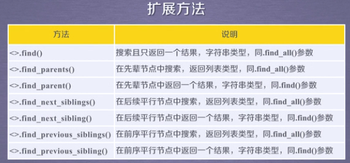


