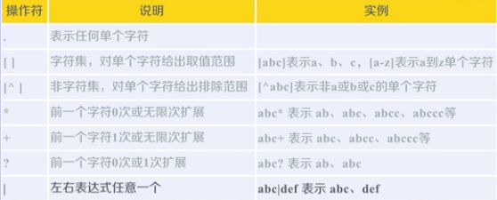
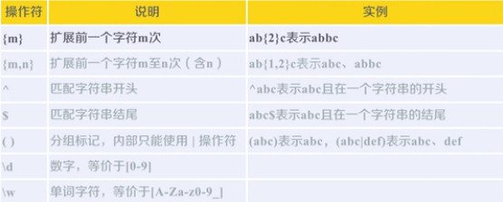
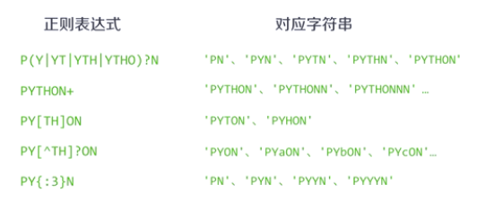
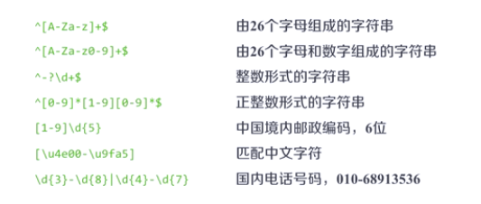
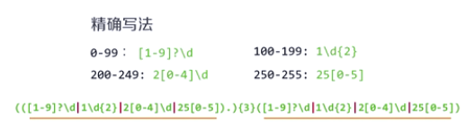
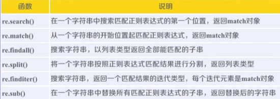

# 正则表达式

regular expression RE

```
'PY....' = PY+
```

- 通用的字符串表达框架

- 简洁表达一组字符串的表达式

- 针对字符串表达*简介*和*特征*思想的工具

- 判断某字符串的特征归属

- 表达文本类型的特征

- 同时查找或替换一组字符串

- 匹配字符串的全部或部分

- 编译：将符合正则表达式语法的字符串转换成正则表达式特征

```
regex = 'P(Y|YT|YTH|YTHO)?N'

p = re.compile(regex)
```

# 正则表达式语法

- 正则表达式由字符和操作符构成

- 常用操作符





- 语法示例





IP地址字符串形式的正则表达式（IP地址分四段，每段0-255）



# RE库的基本使用

```
import re
```

- 正则表达式的表示类型： raw string类型，即表示为：r'text'

```
r'[1-9]\d{5}' #中国地区邮政编码
```

- re库的主要功能函数



1. re.search(pattern,string,flags=0) 返回值是match对象

  pattern: 正则表达式的字符串或原生字符串

  string：待匹配的字符串

  flags：正则表达式使用时的控制标记，常用共有3个
  - re.I re.IGNORECASE 忽略正则表达式的大小写
  - re.M re.MULTILINE  正则表达式中的^操作符能够将给定字符串的每行当作匹配开始
  - re.S re.DOTALL     正则表达式中的.操作符能够匹配所有字符

2. re.match(pattern,string,flags=0) 返回值是match对象

3. re.findall(pattern,string,flags=0) 返回值是列表类型

4. re.split(pattern,string,maxsplit=0,flags=0) 返回值是列表类型

  maxsplit: 最大分割数，剩余部分作为最后一个元素输出

5. re.finditer(pattern,string,flags=0) 返回值是匹配结果的迭代类型，每个迭代类型是一个match对象

6. re.sub(pattern,repl,string,count=0,flags=0) 在一个字符串中**替换**所有匹配正则表达式的子串，返回值是替换后的字符串

  repl：替换的字符串
  count：替换次数

- RE库的另一种等价用法

```
rst = re.search(r'[1-9]\d{5}','bit 100081') #函数式用法：一次操作

pat = re.compile(r'[1-9]\d{5}')

rst = pat.search('bit 100081') #面向对象的用法
```

7. re.compile(pattern,flags=0) 将正则表达式的字符串编译成正则表达式对象
  
# RE库的match对象

- match对象的属性

属性|说明
-|-
.string|待匹配的文本
.re|匹配时使用的pattern对象（正则表达式）
.pos|正则表达式搜索文本的开始位置
.endpos|正则表达式搜索文本的结束位置

- match对象的常用方法

方法|说明
-|-
.group(0)|获得匹配后的字符串
.start()|匹配字符串在原始字符串中的开始位置
.end()|匹配字符串在原始字符串中的结束位置
.span()|返回(.start(),.end())

# re库的贪婪匹配和最小匹配

- re库默认采用贪婪匹配，即输出匹配最长的字符串

- 最小匹配操作符

操作符|说明
-|-
*?|前一个字符的0次或无限次扩展，最小匹配
+?|前一个字符的1次或无限次扩展，最小匹配
??|前一个字符的0次或1次扩展，最小匹配
{m,n}?|前一个字符的m至n次（含n）扩展，最小匹配


