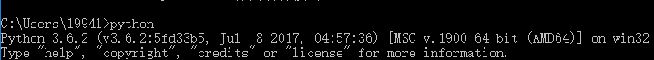
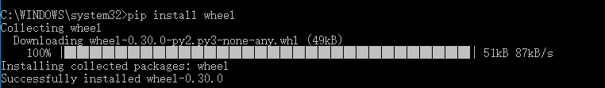
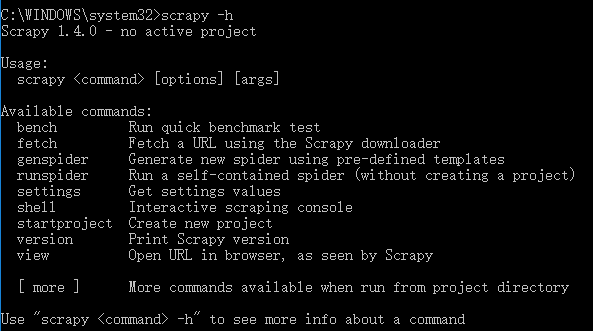
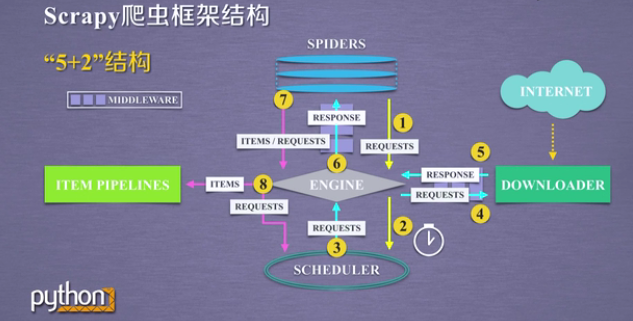
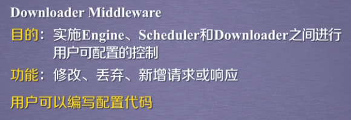

# scrapy 框架

- 安装配置scrapy

安装scrapy，需要twisted依赖，所以需要先安装twisted。

1. 在命令行输入python获得当前python版本



2. 在[Python Extension Packages for Windows](https://www.lfd.uci.edu/~gohlke/pythonlibs/#twisted)下载对应版本的whl文件

3. 安装wheel



4. 进入下载好的.whl文件目录，安装twisted


5. 安装scrapy


6. 大功告成



- scrapy爬虫框架结构

5个数据模块，两个中间键模块，3个数据流路径



框架入口是spiders，出口是item pipelines

engine，downloader和scheduler都是已有的功能实现

**用户只需要编写spiders和item pipelines**

其中spiders用来提供需要访问的url链接，同时解析获得的内容 
item pipelines模块用来对数据进行后处理 

# scrapy爬虫框架解析

- engine 整个框架的核心

控制所有模块之间的数据流

根据条件触发事件

- downloader

根据请求下载网页

- schedular

对所有爬取请求进行调度管理

- downloader middleware



- spiders 

解析downloader返回的响应（response）

产生爬取项（scrapyed item）

产生额外的爬取请求（request）

- item pipelines

流水线方式处理爬取项

由一组操作顺序组成，类似流水线，每一个操作是一个item pipeline类型

可能操作包括：清理，检验和查重爬取项中的html数据，将数据存储到数据库

- spider middleware


# requests库和scrapy爬虫的比较

- 相同点

都可以进行页面请求和爬取

文档丰富，入门简单

都没有处理js，提交表单，应对验证码等功能

- 不同点

requests|scrapy
-|-
页面级爬虫|网站级爬虫
功能库|框架
并发性不足，性能较差|并发性好，性能较高
重点在于页面下载|重点在于爬虫结构
定制灵活|一般使用灵活，深度定制困难

- 如何选取

简单的可以用requests实现

不太小的需求选用scrapy

自搭框架，建议选用requests

# scrapy的常用命令

- scrapy 命令行格式

```
>scrapy <command>[options][args]
```

常用命令|说明|格式
-|-|-
**startproject**|创建新工程|scrapy startproject<name>[dir]
**genspider**|创建一个爬虫|scrapy genspider[options]<name><domain>
settings|获取爬虫配置信息|scrapy settings[options]
**crawl**|运行一个爬虫|scrapy crawl<spider>
list|列出工程中所有爬虫|scrapy list
shell|启动url调试命令行|scrapy shell[url]

- 命令行更加自动化，适合脚本控制


